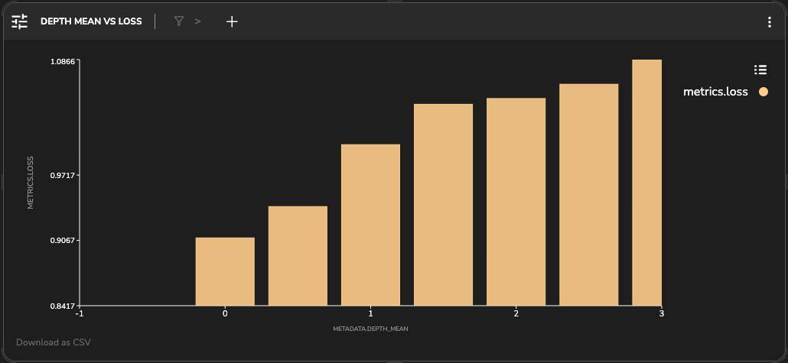

# GLPN: Monocular Depth Estimation 

Depth estimation task using a single image to predict depth.

## The Model
Global-Local Path Networks (GLPN) model trained on KITTI for monocular depth estimation. It was introduced in the paper Global-Local Path Networks for Monocular Depth Estimation with Vertical CutDepth by Kim et al. and first released in this repository. 
The model was retrieved from Huggingface and converted to a .h5 file to be successfully parsed in TL platform. The model is evaluated on its train and validation sets

## The Data
The dataset the model was trained on is KITTI (Karlsruhe Institute of Technology and Toyota Technological Institute). The KITTI dataset is one of the most popular datasets for use in mobile robotics and autonomous driving. It consists of hours of traffic scenarios recorded with a variety of sensor modalities, including high-resolution RGB, grayscale stereo cameras, and a 3D laser scanner. Despite its popularity, the dataset itself does not contain ground truth for semantic segmentation. Ros et al. labeled 170 training images and 46 testing images (from the visual odometry challenge) with 11 classes: building, tree, sky, car, sign, road, pedestrian, fence, pole, sidewalk, and bicyclist. 
The train-test split is based on Monocular Depth Estimation on [KITTI Eigen split unsupervised](https://paperswithcode.com/sota/monocular-depth-estimation-on-kitti-eigen-1) benchmark.

  

    
    
Input Image

  

  

    
    
Depth Ground Truth (GT) 

  

We notice that the GT is very sparse. The Kitti Depth Estimation GT is collected using a lidar sensor. Lidar sensors have a limited range and can't measure the depth of pixels that are too far away or blocked by other objects. 

# TL Insights

The platform automatically detects weaknesses and correlations of the model on specific clusters.

* For instance, the following cluster of samples was detected as samples with a higher SiLog error. 
These samples are all from the same recording date (2011_09_26_drive_0052_sync).

  

    
    
Low Performance Insight

  

  

    
    
The Detected Cluster 

  

* This recording metadata ('folder') we added for the analysis is shown to be significantly distinguished. The model's latent space is separated into several distinct clusters which are highly divided by the recording time.   

*TL Population Exploration samples are colored by the folder variable*

* We can see multiple caught insights of clusters that are under-representated with this variable correlated. 
Since each recording was separated into either a train set or a validation set the clusters are considered to be under-represented. 

  

    
  

  

    
  

  

    
  

  

    
  

* When one of such clusters has low performance, we can use TL to automatically find samples that are represented similarly 
to this weak cluster from a different recording folder and improve the model on.

Choosing representative from the low performance cluster 

* Also, we can qualitatively analyze this representative to better understand the errors. 

Representative Sample Analysis

* We notice an artifact in upper pixels of the model's prediction. In addition to that, the model misses the tree and the upper part of the building.
* This flaw occurs in all cluster samples. This is an important observation since the GT doesn't cover these parts of the image we wouldn't have another way to detect such a cluster. 

# TL Dashboard

From the dashboard, we instantly noticed that for images with higher mean depth or higher depth standard variation (std) the loss increased. 

We have built tests showing that the loss for such populations is above the average loss.

This might be due to the maximum detection range. When the ground truth has a higher depth than other far-away objects in the image which are not labeled, they may confound the model's prediction causing artifacts. Also, the depth variance might be related to possible noise in the measurement or objects with higher depth magnitude.  

  